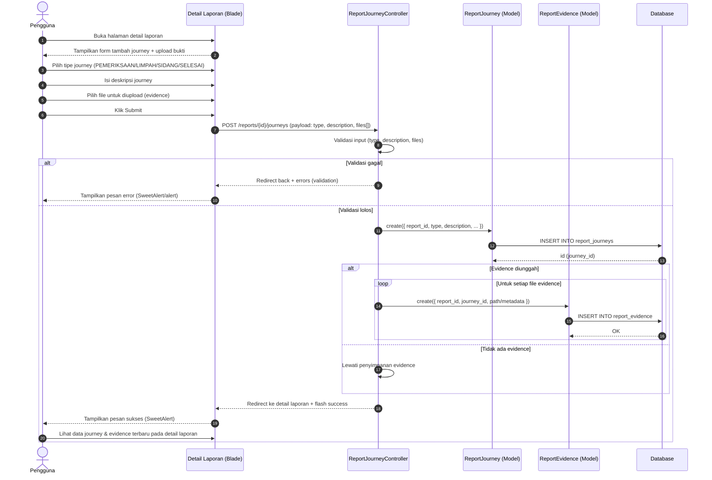

# Sequence Diagram: Fitur Update Journey

Mengacu pada `docs/speckit/update-journey/specify.md`, berikut sequence diagram mermaid untuk alur penambahan journey dan evidence pada detail laporan.



Catatan:
- Journey ditambahkan pada laporan yang sudah ada (report_id diketahui dari route/detail).
- Evidence (bukti) dikaitkan ke report dan journey agar riwayat tertata.
- Bukti file bisa lebih dari satu.
- Feedback validasi/sukses menggunakan SweetAlert sesuai integrasi global.
- Jika menggunakan Service/Repository, layer tersebut disisipkan di antara Controller dan Model tanpa mengubah alur utama.
```